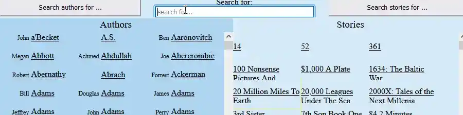

[ppd_g]: https://github.com/steenhansen/python-podcast-downloader#s
[gpd_g]: https://github.com/steenhansen/go-podcast-downloader#s
[gdo_w]: https://github.com/steenhansen/go-podcast-downloader/raw/main/Gui-Podcast-Downloader.exe.zip

[rpd_g]: https://github.com/steenhansen/rust-podcast-downloader#s

[esg_g]: https://github.com/steenhansen/elixir-liveview-snake#s

[esg_w]: https://evening-eyrie-25210-f2edb2eac607.herokuapp.com/Projects-Game/Players-Name

| | |
|-|-|
| **RUST** &nbsp; Terminal UI, Ratatui     &nbsp;&nbsp;&nbsp;&nbsp;&nbsp;&nbsp;&nbsp;&nbsp;&nbsp;&nbsp;&nbsp;&nbsp;_Podcast downloader with_ &nbsp;&nbsp;&nbsp;&nbsp;&nbsp;&nbsp;&nbsp;&nbsp;&nbsp;&nbsp;&nbsp;&nbsp;_mouse driven Interface_  [Repo][rpd_g]              |  

| | |
|-| -|
| **ELIXIR** &nbsp; Phoenix, LiveView  &nbsp;&nbsp;&nbsp;&nbsp;&nbsp;&nbsp;&nbsp;&nbsp;&nbsp;&nbsp;&nbsp;&nbsp;&nbsp;&nbsp;_Multiplayer game_    [Repo][esg_g]         [Running site][esg_w]     |      

| | |
|-|-|
| **PYTHON**       &nbsp;&nbsp;&nbsp;&nbsp;&nbsp;&nbsp;&nbsp;&nbsp;&nbsp;&nbsp;&nbsp;&nbsp;&nbsp;&nbsp;&nbsp;  _Console podcast downloader_     [Repo][ppd_g]   |       

 

| | | | |
|-|-|-:|-|
|  <picture></picture>|  | | |
|       | **NODE.JS**  Vite- plugin -ssr  [Repo][rec_g]    [Running site][rec_w]             |          **REACT NATIVE**   MongoDB   OAuth2  React-Hooks Redux  [Repo][rec_m]    [Google Play][rec_a]  |  
<table>
    <tr>
        <td><picture></picture></td>
        <td>&nbsp;</td>
        <td>&nbsp;</td>
    </tr>
    <tr>
        <td>
         <picture></picture>  <a href="https://github.com/steenhansen/type-czech-phone-recipes/tree/main/test-selenium">Selenium Code</a></td>
        <td> 
         <picture></picture>  <a href="https://6269af43d179dc004af9a1ec-ltzwmhwlbd.chromatic.com/?path=/story/pages-minimalpage--minimal-page">Storybook site</a></td>
        <td>         
        <picture></picture>  <a href="https://github.com/steenhansen/type-czech-phone-recipes/actions/runs/8317745868/job/23219385924">CI/CD site</a></td>
    </tr>
</table>

 

| | |
|-|-|
| **GO** &nbsp; Fyne, Channels, Goroutines     &nbsp;&nbsp;&nbsp;&nbsp;&nbsp;&nbsp;&nbsp;   _go podcast downloader_     [Repo][gpd_g]          |       

 

| | |
|-|-|
| **RXJS** &nbsp; Canvas, Immutablejs    &nbsp;&nbsp;&nbsp;&nbsp;&nbsp;&nbsp;&nbsp;&nbsp;&nbsp;&nbsp;&nbsp;_multi ball breakout game_                 [Repo][brk_g]        [Running site][brk_w]     |         

 

| | |
|-|-|
| **DOCKER** &nbsp; SVG, Neo4j GraphDB    &nbsp;&nbsp;&nbsp;&nbsp;&nbsp;&nbsp;&nbsp;&nbsp;&nbsp;&nbsp;&nbsp;&nbsp;&nbsp;&nbsp;&nbsp;&nbsp;&nbsp;_audiobook search_  [Repo][sli_g]               [DockerHub][swi_d]        [Running site][sli_w]     |         

| | |
|-|-|
| **GRAPHQL** &nbsp; MongoDB    &nbsp;&nbsp;&nbsp;&nbsp;&nbsp;&nbsp;&nbsp;&nbsp;&nbsp;&nbsp;&nbsp;&nbsp;&nbsp;&nbsp;&nbsp;&nbsp;&nbsp;&nbsp;&nbsp;&nbsp;_audiobook search_  [Repo][sgr_g]               [Sleeping site - 150sec wake up][sgr_w]     |         

| | |
|-|-|
| **LAZARUS** &nbsp; Delphi RAD, EXE   &nbsp;&nbsp;&nbsp;&nbsp;&nbsp;&nbsp;&nbsp;&nbsp;&nbsp;&nbsp;&nbsp;&nbsp;&nbsp;&nbsp;&nbsp;&nbsp;&nbsp;&nbsp;&nbsp;&nbsp;_podcast downloader_  [Repo][dsk_g]            |         

| | |
|-|-|
| **TYPESCRIPT** &nbsp; Websockets, Redux  &nbsp;&nbsp;&nbsp;&nbsp;&nbsp;&nbsp;&nbsp;&nbsp;&nbsp;&nbsp;&nbsp;&nbsp;&nbsp;&nbsp;&nbsp;&nbsp;&nbsp;&nbsp;&nbsp;&nbsp;&nbsp;&nbsp;&nbsp;&nbsp;_multiplayer game_  [Repo][elc_g]        [Sleeping site - 150sec wake up][elc_w]          |         

| | |
|-|-|
| **REACT** &nbsp; SSR, GraphicsMagick, Sharp-npm   &nbsp;&nbsp;&nbsp;&nbsp;&nbsp;&nbsp;&nbsp;&nbsp;&nbsp;&nbsp;&nbsp;&nbsp;&nbsp;&nbsp;_automatic resizing image grid_  [Repo][rhg_g]      [npm][rhg_n]    [Sleeping site - 150sec wake up][rhg_w]          |         

| | |
|-|-|
| **REACT** &nbsp; Component, Gulp  &nbsp;&nbsp;&nbsp;&nbsp;&nbsp;&nbsp;&nbsp;&nbsp;&nbsp;&nbsp;&nbsp;&nbsp;&nbsp;&nbsp;_drag on/off/between Google Maps_  [Repo][map_g]      [npm][map_n]    [Sleeping site - 150sec wake up][map_w]          |         

| | |
|-|-|
| **REACT** &nbsp; Responsive, Prototypes  &nbsp;&nbsp;&nbsp;&nbsp;&nbsp;&nbsp;&nbsp;&nbsp;&nbsp;&nbsp;&nbsp;&nbsp;&nbsp;&nbsp;_SSR version of FixedDataTable_  [Repo][iso_g]      [Running site][pod_h]          |         

 

 isomorthphc, typeczech2456

[r_4_two_1]: https://play.google.com/952x238/600*150/

[rec_a]: https://play.google.com/store/apps/details?id=com.fonecook3
[rec_m]: https://github.com/steenhansen/react-native-phone-recipes#fast-start
[rec_g]: https://github.com/steenhansen/type-czech-phone-recipes#fast-start
[rec_w]: https://phone-recipes.herokuapp.com/steenhansen1942/gmail.com
[tcz_g]: https://github.com/steenhansen/type-czech
[tcz_n]: https://www.npmjs.com/package/type-czech
[aon_g]: https://github.com/steenhansen/type-czech-always-on
[aon_w]: https://type-czech-always-on.onrender.com/#freehosting-wait-for-at-least-150-seconds

[can_g]: https://github.com/steenhansen/type-czech-canonical
[can_w]: https://type-czech-canonical.onrender.com/#freehosting-wait-for-at-least-150-seconds

[brk_g]: https://github.com/steenhansen/rxjs-breakout#s
[brk_w]: https://steenhansen.github.io/gh-pages/
[sms_g]: https://github.com/steenhansen/crash-sms
[lbl_g]: https://github.com/steenhansen/rxjs-label-maker
[lbl_w]: https://steenhansen.github.io/rxjs-label-maker/
[drg_g]: https://github.com/steenhansen/rxjs-drag-n-drop
[drg_w]: https://steenhansen.github.io/rxjs-drag-n-drop/
[aut_c]: https://codepen.io/steen-hansen/pen/XWEXYgQ
[ctd_g]: https://github.com/steenhansen/clojure-text-diff
[mon_g]: https://gist.github.com/steenhansen/f9a9e9eee2fd563e378d8ddfce98cf0a
[val_g]: https://gist.github.com/steenhansen/5a0dbad5388a79ebb900b257fc7a129c
[ram_g]: https://gist.github.com/steenhansen/3e8c320725c6196c9a259661473dec42
[php_a]: https://gist.github.com/steenhansen/6b15623db6139c429c4fdf6f46ae9745
[rnt_g]: https://github.com/steenhansen/react-native-google-signin-verified

[sli_g]: https://github.com/steenhansen/sffaudio-search-docker-compose
[sli_w]: http://45.79.183.31/?author=isaac-asimov
[sli_m]: http://45.79.183.31/?book=sci-fi-private-eye&author=isaac-asimov,robert-silverberg,poul-anderson,fred-saberhagen,edward-wellen,philip-k-dick
[sli_r]: http://45.79.183.31/?book=beyond-lies-the-wub&author=philip-k-dick&view=rsd&choice=1
[swi_g]: https://github.com/steenhansen/sffaudio-search-docker-run
[swi_d]: https://hub.docker.com/r/steenhansen/sff-audio-search
[sku_g]: https://github.com/steenhansen/sffaudio-search-kubernetes
[sku_d]: https://hub.docker.com/r/steenhansen/sff-audio-kube
[sgr_g]: https://github.com/steenhansen/sffaudio-graph-ql
[sgr_w]: https://sffaudio-graph-ql.onrender.com/graphiql?operationName=serch_ql&query=query%20serch_ql(%24search_parameter%3A%20String!)%20%7B%0A%20%20search_site_content(search_text%3A%20%24search_parameter)%20%7B%0A%20%20%20%20%20%20...%20on%20ArticlePage%7B%20ID%20headline%20article_post%20%20%20%7D%2C%0A%20%20%20%20...%20on%20MentionPage%7B%20ID%20headline%20mention_post%20%20%20%7D%2C%0A%20%20%20%20...%20on%20RsdMedia%20%7B%20ID%20rsd_post%20resource%0A%20%20%20%20%20%20%20%20%20%20%20%20%20%20%20%20%20%20%20%20%20%20book%7B%20author%20title%20%7D%0A%20%20%20%20%20%20%20%20%20%20%20%20%20%20%20%20%20%20%20%20%20%20podcast%20%7B%20description%20mp3%20length%20episode%20%7D%20%20%20%7D%2C%0A%20%20%20%20...%20on%20SffAudioMedia%20%7B%20ID%20sffaudio_post%20narrator%0A%20%20%20%20%20%20%20%20%20%20%20%20%20%20%20%20%20%20%20%20%20%20%20%20%20%20%20possiblebook%7B%20author%20title%20%7D%0A%20%20%20%20%20%20%20%20%20%20%20%20%20%20%20%20%20%20%20%20%20%20%20%20%20%20%20podcast%20%7B%20description%20mp3%20length%20episode%20%7D%20%20%20%7D%0A%20%20%7D%0A%7D%0A&variables=%7B%0A%20%20%22search_parameter%22%3A%20%22Clarke%22%0A%7D

[sgr_j]: https://sffaudio-graph-ql.onrender.com/graphql?operationName=serch_ql&query=%0Aquery%20serch_ql(%24search_parameter%3A%20String!)%20%7B%0A%20search_site_content(search_text%3A%20%24search_parameter)%20%7B%0A%20...%20on%20ArticlePage%7B%20ID%20headline%20article_post%20%7D%2C%0A%20...%20on%20MentionPage%7B%20ID%20headline%20mention_post%20%7D%2C%0A%20...%20on%20RsdMedia%20%7B%20ID%20rsd_post%20resource%0A%20book%20%7B%20author%20title%20%7D%0A%20podcast%20%7B%20description%20mp3%20length%20episode%20%7D%20%7D%2C%0A%20...%20on%20SffAudioMedia%20%7B%20ID%20sffaudio_post%20narrator%20about%0A%20possiblebook%7B%20author%20title%20%7D%0A%20podcast%20%7B%20description%20mp3%20length%20episode%20%7D%20%7D%2C%0A%20...%20on%20PdfMedia%20%7B%20ID%0A%20book%20%7B%20author%20title%20%7D%0A%20issues%20%7B%20url%20publisher%20pages%20%7D%20%7D%0A%20%7D%0A%7D%20&variables=%7B%20%22search_parameter%22%3A%20%22clarke%22%7D

[pod_h]: https://sffaudio.herokuapp.com/podcast/table
[rsd_h]: https://sffaudio.herokuapp.com/rsd/table
[pod_s]: https://docs.google.com/spreadsheets/d/1cWtA1AaY83cBuU_6vt64adDeR-dfT-X1U5VgvCRVMAg/edit#gid=0
[rsd_s]: https://docs.google.com/spreadsheets/d/1VFMgWy6wmTkFIpeNW-NkZdWmpz5iZcuULgMpjn8_QgU/edit#gid=0
[pod_w]: https://www.sffaudio.com/the-sffaudio-podcast/
[rsd_w]: https://www.sffaudio.com/reading-short-and-deep/
[elc_g]: https://github.com/steenhansen/electric-snakes
[elc_w]: https://electric-snakes.onrender.com/create-game/#freehosting-wait-for-at-least-150-seconds
[dsk_g]: https://github.com/steenhansen/podcast-downloader#screen-shot
[dsk_w]: https://github.com/steenhansen/podcast-downloader/raw/master/podcast-downloader-exes.zip
[rhg_g]: https://github.com/steenhansen/react-hover-grid
[rhg_n]: https://www.npmjs.com/package/react-hover-grid
[rhg_w]: https://react-hover-grid.onrender.com/#freehosting-wait-for-at-least-150-seconds
[rhg_e]: https://github.com/steenhansen/react-hover-grid-examples
[map_g]: https://github.com/steenhansen/gmap-dragdrop-react
[map_n]: https://www.npmjs.com/package/gmap-dragdrop-react
[map_w]: https://gmap-dragdrop-examples.onrender.com/maps#freehosting-wait-for-at-least-150-seconds
[map_e]: https://github.com/steenhansen/gmap-dragdrop-examples
[iso_g]: https://github.com/steenhansen/Isomorphic-React-on-Heroku
[php_g]: https://github.com/steenhansen/php-google-api-example
[ang_g]: https://github.com/steenhansen/sffaudio-podcasts-angular

