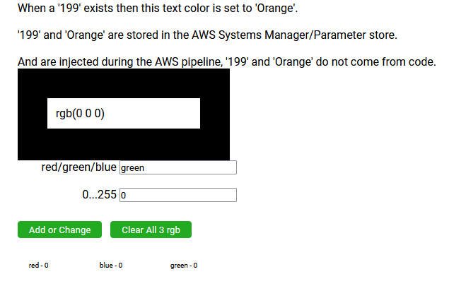
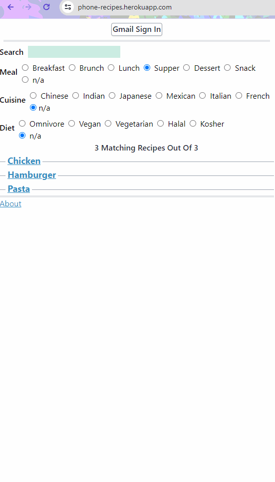
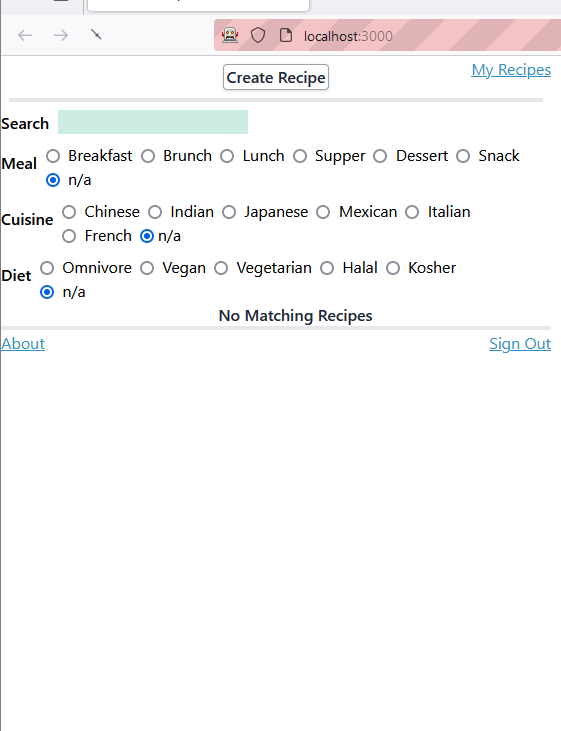
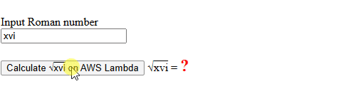
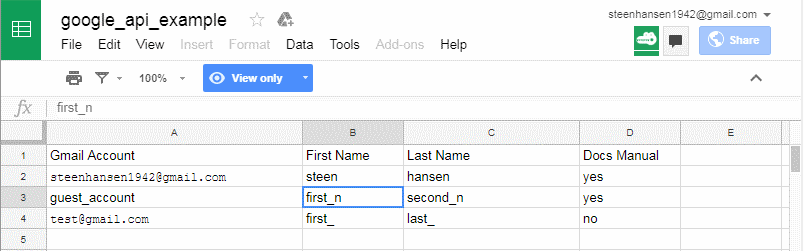

<table>
 <tr>
       <td width="400">
        <b>AWS CDK ----- </b> &nbsp; Local TypeScript Development with CI/CD &nbsp;&nbsp;&nbsp;&nbsp;&nbsp;&nbsp;&nbsp;&nbsp;&nbsp;&nbsp;&nbsp;&nbsp;&nbsp;&nbsp;&nbsp;&nbsp;&nbsp;&nbsp;&nbsp;&nbsp;<i>Lambdas, DynamoBD, and CloudFront</i>   
        <a href="https://github.com/steenhansen/AWS-CDK-in-Practice-example#s">Repo</a> 
        </td>
        <td width="260">
               
        </td>
    </tr>
</table>

<table>
 <tr>
       <td width="260">
        <b>ELIXIR</b> &nbsp; Phoenix, LiveView  &nbsp;&nbsp;&nbsp;&nbsp;&nbsp;&nbsp;&nbsp;&nbsp;&nbsp;&nbsp;&nbsp;&nbsp;&nbsp;&nbsp;<i>Multiplayer game</i>   
        <a href="https://github.com/steenhansen/elixir-liveview-snake#s">Repo</a> 
        </td>
        <td width="400">
               
        </td>
    </tr>
</table>

<table>
 <tr>
       <td width="260">
        <b>RUST</b> &nbsp; Terminal UI, Ratatui 
        &nbsp;&nbsp;&nbsp;&nbsp;&nbsp;&nbsp;&nbsp;&nbsp;&nbsp;&nbsp;&nbsp;&nbsp;<i>Podcast downloader with</i> 
          &nbsp;&nbsp;&nbsp;&nbsp;&nbsp;&nbsp;&nbsp;&nbsp;&nbsp;&nbsp;&nbsp;&nbsp;<i>mouse driven Interface</i> 
        <a href="https://github.com/steenhansen/rust-podcast-downloader#s">Repo</a>
        </td>
        <td width="400">
               
        </td>
    </tr>
</table>

<table>
 <tr>
       <td width="200">
            <i>Recipes App</i> 
               
        </td>
        <td width="90">
           <b>REACT&nbsp;NATIVE</b> 
            MongoDB   
            OAuth2  
            React&nbsp;Hooks 
            Redux 
            <a href="https://github.com/steenhansen/react-native-phone-recipes#s">Repo</a> 
            &nbsp;&nbsp;&nbsp;&nbsp;&nbsp;
                 
        </td>
        <td width="90" align="right"  >
                 <b>NODE.JS</b> 
            Vite SSR 
            Mocha 
            Vitest JSX 
            <a href="https://github.com/steenhansen/type-czech-phone-recipes#s">Repo</a>   
        </td>
        <td width="200" align="center">
                 
        </td>
    </tr>
<tr>
  <td align="center">
         <picture>&nbsp;</picture><a href="https://6269af43d179dc004af9a1ec-ltzwmhwlbd.chromatic.com/?path=/story/pages-minimalpage--minimal-page">Storybook site</a>
    </td>
        <td colspan="2"  align="center">
    <picture> </picture> <a href="https://github.com/steenhansen/type-czech-phone-recipes/tree/main/test-selenium">Selenium Test Run</a>
        </td>
        <td  align="center"><picture></picture> <a href="https://github.com/steenhansen/type-czech-phone-recipes/actions/runs/8317745868/job/23219385924">CI/CD site</a></td>
    </tr>
</table>

<table>
 <tr>
       <td width="260">
        <b>GO</b>  &nbsp; Fyne, Channels, Goroutines     &nbsp;&nbsp;&nbsp;&nbsp;&nbsp;&nbsp;&nbsp;&nbsp;   <i>podcast downloader</i>   
        <a href="https://github.com/steenhansen/go-podcast-downloader#s">Repo</a>  
        </td>
        <td width="400">
               
        </td>
    </tr>
</table>

<table>
 <tr>
       <td width="260">
        <b>RXJS</b>  &nbsp; Canvas, Immutablejs    &nbsp;&nbsp;&nbsp;&nbsp;&nbsp;&nbsp;&nbsp;&nbsp;&nbsp;&nbsp;&nbsp; <i>Multi ball breakout game</i>   
        <a href="https://github.com/steenhansen/rxjs-breakout#s">Repo</a> 
        <a href="https://steenhansen.github.io/rxjs-breakout/">Running site</a>
        </td>
        <td width="400">
               
        </td>
    </tr>
</table>

<table>
 <tr>
       <td width="260">
        <b>DOCKER</b>  &nbsp;SVG, Neo4j GraphDB    &nbsp;&nbsp;&nbsp;&nbsp;&nbsp;&nbsp;&nbsp;&nbsp;&nbsp;&nbsp;&nbsp;&nbsp;&nbsp;&nbsp;&nbsp;&nbsp;&nbsp;<i>SPA Audiobook search</i>   
        <a href="https://github.com/steenhansen/sffaudio-search-docker-compose#s">Repo</a> 
        <a href="https://hub.docker.com/r/steenhansen/sff-audio-search">DockerHub</a> 
          
         <b>KUBERNETES</b>   
        <a href="https://github.com/steenhansen/sffaudio-search-kubernetes#s">Repo</a> 
        <a href="https://hub.docker.com/r/steenhansen/sff-audio-kube">DockerHub</a> 
        </td>
        <td width="400">
               
        </td>
    </tr>
</table>

<table>
 <tr>
       <td width="260">
        <b>GRAPHQL</b>  &nbsp; MongoDB    &nbsp;&nbsp;&nbsp;&nbsp;&nbsp;&nbsp;&nbsp;&nbsp;&nbsp;&nbsp;&nbsp;&nbsp;&nbsp;&nbsp;&nbsp;&nbsp;&nbsp;&nbsp;&nbsp;&nbsp;<i>Audiobook search</i>   
        <a href="https://github.com/steenhansen/sffaudio-graph-ql#s">Repo</a> 
        <a href="https://sffaudio-graph-ql.onrender.com/graphiql?operationName=serch_ql&query=query%20serch_ql(%24search_parameter%3A%20String!)%20%7B%0A%20%20search_site_content(search_text%3A%20%24search_parameter)%20%7B%0A%20%20%20%20%20%20...%20on%20ArticlePage%7B%20ID%20headline%20article_post%20%20%20%7D%2C%0A%20%20%20%20...%20on%20MentionPage%7B%20ID%20headline%20mention_post%20%20%20%7D%2C%0A%20%20%20%20...%20on%20RsdMedia%20%7B%20ID%20rsd_post%20resource%0A%20%20%20%20%20%20%20%20%20%20%20%20%20%20%20%20%20%20%20%20%20%20book%7B%20author%20title%20%7D%0A%20%20%20%20%20%20%20%20%20%20%20%20%20%20%20%20%20%20%20%20%20%20podcast%20%7B%20description%20mp3%20length%20episode%20%7D%20%20%20%7D%2C%0A%20%20%20%20...%20on%20SffAudioMedia%20%7B%20ID%20sffaudio_post%20narrator%0A%20%20%20%20%20%20%20%20%20%20%20%20%20%20%20%20%20%20%20%20%20%20%20%20%20%20%20possiblebook%7B%20author%20title%20%7D%0A%20%20%20%20%20%20%20%20%20%20%20%20%20%20%20%20%20%20%20%20%20%20%20%20%20%20%20podcast%20%7B%20description%20mp3%20length%20episode%20%7D%20%20%20%7D%0A%20%20%7D%0A%7D%0A&variables=%7B%0A%20%20%22search_parameter%22%3A%20%22Clarke%22%0A%7D">Sleeping site - 150sec wake up</a>
        </td>
        <td width="400">
               
        </td>
    </tr>
</table>

<table>
 <tr>
       <td width="300">
        <b>TYPESCRIPT</b>  &nbsp; WebSockets, Redux    &nbsp;&nbsp;&nbsp;&nbsp;&nbsp;&nbsp;&nbsp;&nbsp;&nbsp;&nbsp;&nbsp;&nbsp;&nbsp;&nbsp;&nbsp;&nbsp;&nbsp;&nbsp;&nbsp;&nbsp;&nbsp;&nbsp;&nbsp;&nbsp;<i>Multiplayer game</i>   
        <a href="https://github.com/steenhansen/electric-snakes#s">Repo</a> 
        <a href="https://electric-snakes.onrender.com/create-game/#freehosting-wait-for-at-least-150-seconds">Sleeping site - 150sec wake up</a>
        </td>
        <td width="360">
               
        </td>
    </tr>
</table>

<table>
 <tr>
       <td width="260">
        <b>LAZARUS</b>  &nbsp; Delphi RAD, EXE     &nbsp;&nbsp;&nbsp;&nbsp;&nbsp;&nbsp;&nbsp;&nbsp;&nbsp;&nbsp;&nbsp;&nbsp;&nbsp;&nbsp;&nbsp;&nbsp;&nbsp;&nbsp;&nbsp;<i>podcast downloader</i>   
        <a href="https://github.com/steenhansen/podcast-downloader#s">Repo</a>  
        </td>
        <td width="400">
               
        </td>
    </tr>
</table>
  
<table>
 <tr>
       <td width="290">
        <b>REACT</b>  &nbsp; SSR, GraphicsMagick, Sharp    &nbsp;&nbsp;&nbsp;&nbsp;&nbsp;&nbsp;&nbsp;&nbsp;&nbsp;&nbsp;&nbsp;&nbsp;&nbsp; <i>Resizing image grid</i>   
        <a href="https://github.com/steenhansen/react-hover-grid#s">Repo</a> 
        <a href="https://www.npmjs.com/package/react-hover-grid">npm</a> 
        <a href="https://steens-bucket.s3.us-east-2.amazonaws.com/lambda-hover.html">Running site</a>
        </td>
        <td width="370">
               
        </td>
    </tr>
</table>

<table>
 <tr>
       <td width="260">
        <b>REACT</b>  &nbsp; Component, Gulp   &nbsp;&nbsp;&nbsp;&nbsp;&nbsp;&nbsp;&nbsp;&nbsp;&nbsp;&nbsp;&nbsp;&nbsp;&nbsp; <i>Drag on/off/between &nbsp;&nbsp;&nbsp;&nbsp;&nbsp;&nbsp;&nbsp;&nbsp;&nbsp;&nbsp;&nbsp;&nbsp;&nbsp;&nbsp;Google Maps</i>   
        <a href="https://github.com/steenhansen/gmap-dragdrop-react#s">Repo</a> 
        <a href="https://www.npmjs.com/package/gmap-dragdrop-react">npm</a> 
        <a href="https://steens-bucket.s3.us-east-2.amazonaws.com/lambda-maps.html">Running site</a>
        </td>
        <td width="400">
               
        </td>
    </tr>
</table>

<table>
 <tr>
       <td width="260">
        <b>REACT</b>  &nbsp; Responsive, Prototypes    &nbsp;&nbsp;&nbsp;&nbsp;&nbsp;&nbsp;&nbsp;&nbsp;&nbsp;&nbsp;&nbsp;&nbsp;&nbsp; <i>SSR version of
         &nbsp;&nbsp;&nbsp;&nbsp;&nbsp;&nbsp;&nbsp;&nbsp;&nbsp;&nbsp;&nbsp;&nbsp;&nbsp;FixedDataTable</i>   
        <a href="https://github.com/steenhansen/Isomorphic-React-on-Heroku#s">Repo</a> 
        <a href="https://sffaudio.herokuapp.com/podcast/table/">Running site</a>
        </td>
        <td width="400">
               
        </td>
    </tr>
</table>

<table>
 <tr>
       <td width="260">
        <b>JAVASCRIPT</b>   &nbsp;  AWS Lambda    
        <a href="https://github.com/steenhansen/roman-square-roots-aws-lambda#s">Repo</a> 
        <a href="https://single-html.s3.us-west-2.amazonaws.com/roman-lamba.html">Running site</a>   
        </td>
        <td width="400">
               
        </td>
    </tr>
</table>

<table>
 <tr>
       <td width="240">
        <b>PYTHON</b>  &nbsp; <i>Console podcast &nbsp;&nbsp;&nbsp;&nbsp;&nbsp;&nbsp;&nbsp;&nbsp;&nbsp;&nbsp;&nbsp;&nbsp;&nbsp;&nbsp;&nbsp;&nbsp;&nbsp;&nbsp; downloader</i>   
        <a href="https://github.com/steenhansen/python-podcast-downloader#s">Repo</a>  
        </td>
        <td width="420">
               
        </td>
    </tr>
</table>

<table>
 <tr>
       <td width="320">
        <b>PHP</b>  &nbsp; <i>Google Sheets as user authentication 
        &nbsp;&nbsp;&nbsp;&nbsp;&nbsp;&nbsp;&nbsp;&nbsp;&nbsp; and authorization database for 
        &nbsp;&nbsp;&nbsp;&nbsp;&nbsp;&nbsp;&nbsp;&nbsp;&nbsp; a WordPress site</i>   
        <a href="https://github.com/steenhansen/php-google-api-example">Repo</a>  
        </td>
        <td width="340">
               
        </td>
    </tr>
</table>

<table>
  <tr>
       <td width="660">
        <a href="https://web.archive.org/web/20110204235449/http://hansendisplays.com/"
         >Hansen Displays, 1/3 Owner</a>
         &nbsp;-&nbsp;
         <a href="https://file.garden/aFRi5x2D4TDUTvOr/hansen-displays-brochure_us.pdf"
         >Price List</a>
        &nbsp;-&nbsp;
        <a href="https://file.garden/aFRi5x2D4TDUTvOr/hansen-displays-photo.jpg"
         >Post Card</a>
  </tr>
</table>

<table>
  <tr>
       <td width="660">
        <a href="https://forums.atariage.com/topic/287343-the-persistent-ram-cartridge/#comment-5075938"
         >Intra-Tech, 1/3 Owner</a>
         &nbsp;-&nbsp;
         <a href="https://file.garden/aFRi5x2D4TDUTvOr/persistant-ram-front.jpg"
         >Cartridge Front</a>
           &nbsp;-&nbsp;
         <a href="https://file.garden/aFRi5x2D4TDUTvOr/persistant-ram-chips.jpg"
         >Cartridge Chips</a>
  </tr>
</table>
